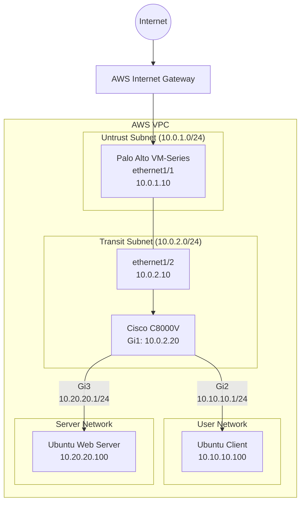

| Component | Interface | Network | Private IP | Purpose |
|-----------| ----------| -------- | -------- | ---------|
| Palo Alto | Management | 10.0.0.0/24 | 10.0.0.10 | Administration|
| Palo Alto | Ethernet 1/1 | 10.0.1.0/24 | 10.0.1.10 | Untrust |
| Palo Alto | Ethernet 1/2 | 10.0.2.0/24 | 10.0.2.10 | Trust/Transit |
| Cisco | Gigabit 1 | 10.0.20.0/24 | 10.0.20.10 | Firewall Facing |
| Cisco | Gigabit 2 | 10.10.10.0/24| 10.10.10.1 | User Gateway |
| Cisco | Gigabit 3 | 10.20.20.0/24 | 10.20.20.1 | Server Gateway |
| Linux Client | ens1 | 10.10.10.0/24 | 10.10.10.100 | User endpoint |
| Linux Server| ens1 | 10.20.20.0/24 | 10.20.20.100 | Internal webserver | 

# AWS Enterprise Network Lab – Palo Alto VM-Series + Cisco C8000V

## Network Topology

---
