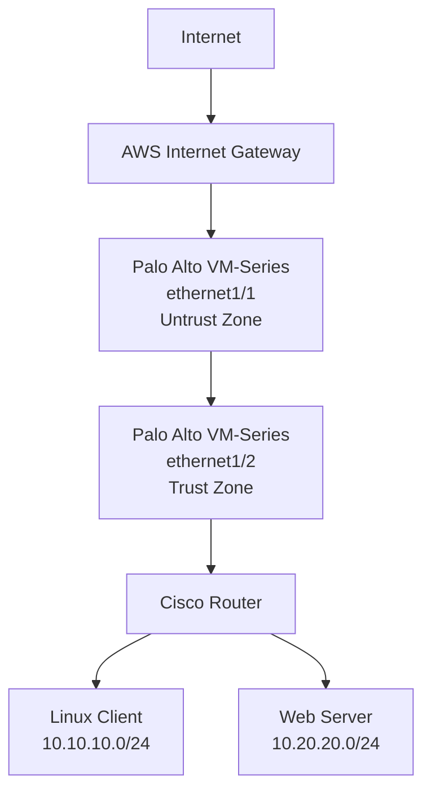

# AWS-Palo Alto Enterprise Firewall lab
 AWS Enterprise Network Lab with Palo Alto VM-Series and Cisco Router

# **Overview:**
This project demonstartes  the deployment of a small enterprise network in AWS using:
- Palo Alto VM-Series Firewall
- Cisco Virtual routers
- Linux client and server instances
- AWS VPC networking
- Secuirty policies
- Routing - BGP
- Source NAT
- Destination NAT
- Traffic logging and Packet-flow validation
# **Objectives:**
## This project demonstrates:
- Enterprise firewall placement
- Trust, Untrust and DMZ security zone
- Source NAT for outbound traffic
- Destination ANT for inbound traffic
- Cisco-to-Palo Alto routing using BGP
- AWS route table configuration
- Traffic log analysis
- Packet capture and troubleshooting
- Real-world failure scenarios
## Architecture
The Palo Alto Firewall acts as a enterprise Internet-edge firewal

                  
